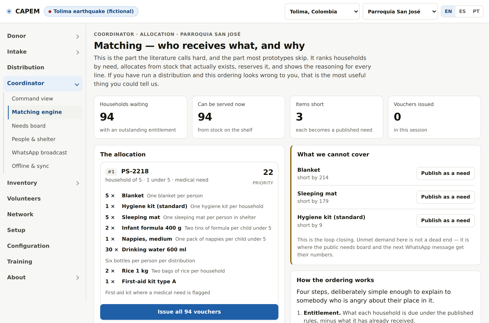

# CAPEM

**Centros de Apoyo en Emergencias · Centros de Apoio em Emergências · Emergency Support Centres**

An open concept prototype for running the building that becomes a relief centre — a church, a school, a gymnasium that was doing something else last week and is now sheltering three hundred people and receiving donations nobody asked for.

**→ [Open the prototype](https://philthemoser.github.io/capem/)** · works on a phone · English, Español, Português

> **Everything in the prototype is fictional.** Both scenarios are invented, including every centre, household, quantity and event. The regions and the underlying problems are real; nothing else is. This has never been used in a real response and should not be until people who have run one have taken it apart.



---

## The problem, in one paragraph

Disaster response repeats the same failures. Donors give what they have rather than what is needed, and the goods that arrive can overwhelm the capacity to sort them. Volunteers converge unevenly — some sites have more people than they can use while others go unserved. And nobody has a current picture of what is where. The centres carrying this are frequently improvised: in the 2024 Rio Grande do Sul floods, 803 shelters operated at peak, the great majority in buildings never designed for the purpose, and post-event research identifies churches and community centres as the most suitable of them. Several ran largely on their own resources.

The realistic customer is not a disaster agency with an IT department. It is a parish that needs to be operational this afternoon.

## What CAPEM proposes

Three things, of which only the first is unusual.

**1. Donations described before they travel.** A donor packs one category per bag, describes each bag in a web page with no account, and gets a single code with a scannable tag. At the door, intake is a scan rather than an interrogation, the bag goes to a shelf without being opened, and the centre can steer what arrives *before* the donor sets off — which is the only point at which refusing something is free.

**2. Allocation that can be explained out loud.** Households are ranked by openly-scored need, allocated from stock that actually exists, and stock is reserved when the voucher is issued rather than when it is handed over. Every line names the rule that produced it and every ranking shows its arithmetic. This is deliberately not an optimiser: something cleverer would allocate marginally better and be impossible to defend to somebody angry about their place in the queue.

**3. Blocks on a spine.** One shared reference (donation codes, household references, vouchers) plus a minimal contract, so a centre already tracking people on paper adopts only the piece it is missing rather than replacing what works.

## What is actually new here

This matters to state precisely, because a novelty claim that does not survive five minutes of checking discredits everything else.

**We found no published precedent** for registration at the level of the individual container — a scannable tag on that specific bag or box, scanned in at the door.

**But the broader idea has a precedent, and it failed.** The Aidmatrix-powered **National Donations Management Network** let donors post goods offers online for agencies to accept before shipment, from the late 2000s. That is genuine donor-side pre-registration, at the level of the *offer* rather than the container, with no tagging and no scan-in. It is now defunct. `aidmatrixnetwork.org` still carries NDMN marketing copy but has been repurposed entirely.

Two honest consequences:

- Our differentiation rests on the *unit of registration*, the *artefact*, and the *moment of capture* — not on the idea of registering donations before they move. That is a narrower claim than "nobody has done this".
- **Why NDMN failed is a question we cannot answer**, and it is the single most useful thing a reader of this repository could tell us. Defunct platforms rarely publish post-mortems, and we would rather learn the lesson from someone who watched it than repeat it.

In the commercial sector, [ReSupply](https://resupply.com/) already has individual donors itemise goods online — for scheduled furniture pickups rather than disaster drop-offs.

Full landscape scan, including Good360, Sahana Eden, Crisis Cleanup, CharityTracker, KoboToolbox, RedRose and others: **[docs/research.md](docs/research.md)**.

## What the prototype actually does

Not a click-through. The screens share one data model, so actions propagate:

- Confirm a bag at intake and the donor's progress bar, the coordinator's coverage figure, the inventory line and the public needs board all move, because there is one number to move.
- Run the matching engine and it ranks ~94 households against real stock, runs out of blankets, and pushes the shortfall back onto the public needs board.
- Switch the connection off, confirm donations anyway, and watch the queue drain on reconnect.
- The QR codes are real. Scan one with your phone.

| | |
|---|---|
| **Screens** | 24, across donor · intake · gate · coordinator · inventory · volunteers · network · setup · configuration · training · scope |
| **Languages** | English, Español, Português — full UI, locale-correct currency (COP / BRL) |
| **Scenarios** | Two fictional: an earthquake in Tolima, Colombia; floods in Rio Grande do Sul, Brazil |
| **Dependencies** | None. One self-contained HTML file, no build step to view, no server, no tracking |

## The parts we are least sure about

The most useful page in the prototype is **[Open questions](https://philthemoser.github.io/capem/#/about/about-questions)**. Eight decisions that cannot be made from a desk, each with a plausible answer built in and no evidence behind it. Briefly:

1. **Will donors actually pre-register?** The whole design rests on a stranger doing sixty seconds of unpaid admin before an act of generosity. It may simply fail.
2. **Is the allocation ordering defensible in a real queue?** The scoring is invented. It looks reasonable on a screen.
3. **Does a three-minute in-app course produce a competent volunteer,** or false confidence — which at an intake table is worse than admitted ignorance?
4. **What breaks when two centres edit the same stock offline?** We have not solved this.
5. **Who is liable when the software is wrong** and a family is sent away empty?
6. **Should money and goods share one flow** when money brings financial controls a small centre may not want to touch?
7. **Is a QR the right artefact** given charged phones, working cameras and donor comfort?
8. **Why did Aidmatrix / NDMN fail?** We are building on a guess about that, and the guess may be the wrong one.

## Data protection

People arriving at a shelter cannot meaningfully refuse a form, which means consent is usually not an appropriate legal basis. The ICRC *Handbook on Data Protection in Humanitarian Action* (3rd ed., November 2024) is explicit about this and offers vital interest, important grounds of public interest, and legitimate interest instead — each of which puts the burden of judgement on the organisation rather than on someone who cannot say no.

The design response is to collect less rather than to consent better: household size, children under five, adults over 65, a medical flag. No identity numbers, no addresses, no nationality, no ethnicity or religion, no biometrics. Aggregates flow out; records stay at the centre.

What that does **not** solve — an official asking for the list, what happens to records when a centre closes, the exposure of the paper fallback — is set out honestly in **[docs/data-protection.md](docs/data-protection.md)**.

## Repository

```
index.html              the prototype, self-contained and committed — open it directly
build.js                concatenates src/ into index.html (node build.js, no dependencies)
src/
  styles.css
  js/00-i18n.js         all 899 strings as [en, es, pt] triples
  js/01-data.js         the two scenarios — one source of truth for every screen
  js/04-store.js        reactive store + derived selectors
  js/05-qr.js           QR encoder (byte mode, EC level M) — verified against a reference encoder
  js/06-match.js        the matching engine
  js/2*-*.js            screens
docs/
  research.md           the evidence base, cited, with confidence ratings and what we could not verify
  data-protection.md    the ICRC position and what this design does not solve
  concept.md            the full design argument
  architecture.md       data model, module boundaries, why single-file
  roadmap.md            phases, and what would have to be true to proceed
  naming.md             why "CAPEM", and the trademark screening behind it
tools/                  i18n completeness, QR correctness, accessibility, end-to-end flow tests
```

### Verification

Claims about a prototype are cheap, so these are checkable:

```bash
node build.js              # rebuild index.html from src/
node tools/check-i18n.js   # every key used exists; every row has all three languages
node tools/smoke.js        # all 24 screens render in 3 languages × 2 scenarios (144 renders)
node tools/flow.js         # 21 end-to-end assertions: does state actually propagate?
node tools/nav.js          # navigation: stable order, expand-in-place, mobile sheet
node tools/a11y.js         # axe-core, WCAG 2.1 A/AA
node tools/verify-qr.js tools/qr-tests.json > /tmp/o.json && python3 tools/verify-qr.py /tmp/o.json
```

Current status: i18n complete · 144/144 renders · 21/21 flow assertions · 13/13 navigation assertions · 0 WCAG A/AA violations · 6/6 QR codes decode.

## How to tell us we are wrong

Sharp disagreement from someone who has done the work is far more useful to this project than agreement. **Open an issue in English, Spanish or Portuguese** — whichever you would rather write in.

Most valuable, roughly in order:

1. You have run a relief centre and the allocation ordering is wrong.
2. You know why Aidmatrix / NDMN failed.
3. You know the data-protection position is legally mistaken in your jurisdiction.
4. You have run a donation drive and can say what fraction of donors would ever pre-register.
5. Something in `docs/research.md` is misattributed or overstated.

## Status and licence

Concept prototype. Not production software, not piloted, not validated. No efficiency claim in this repository is a measured result; they are all hypotheses.

Licensed under [Apache 2.0](LICENSE). "CAPEM" is a working name — see [docs/naming.md](docs/naming.md) for the screening and the remaining trademark risk.
