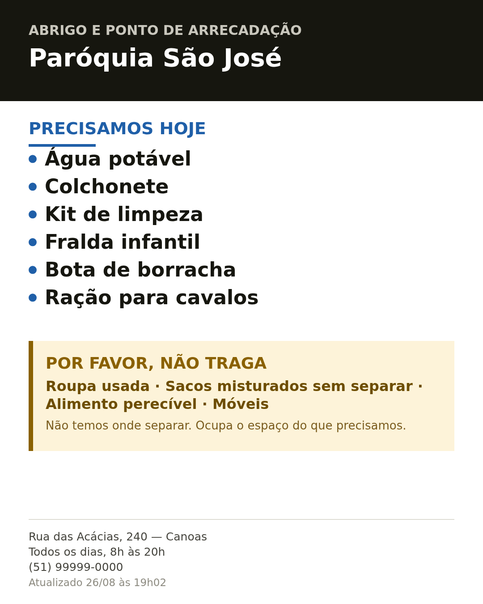

# CAPEM Campo — ferramentas de campo

Ferramentas simples para pontos de arrecadação e abrigos. Não são demonstração:
são para usar.

Cada uma é **um arquivo só**. Funciona sem internet, sem cadastro e sem servidor.
Dá para abrir de um pen drive, mandar por e-mail ou salvar no celular.

---

## 1. Kit de material impresso — `kit.html` ✅ pronto

Preencha os dados do centro **uma vez** e saem **quinze peças** prontas.

**Como usar:** abra o arquivo no celular ou no computador, preencha o nome, o
endereço, o horário, o telefone e o que precisa hoje. Cada peça tem um botão
para imprimir; as duas de WhatsApp têm um botão para gerar a imagem.



**Comece por aqui**

| Peça | Formato |
|---|---|
| Folha de instruções | A4 retrato |

Onde pregar o quê, e o que fazer todos os dias. É a explicação do kit, e é
impressa de propósito: quem monta um centro está com fita-cola na mão no meio
de um ginásio, não a ler um site. Uma folha pregada na parede do fundo
continua a responder à pergunta ao turno seguinte.

**Família 1 — anunciar (para fora)**

| Peça | Formato |
|---|---|
| Cartaz de porta | A4 retrato |
| Placa de rua | A3 retrato |
| Post de WhatsApp | 1080 × 1350 |
| Status de WhatsApp | 1080 × 1920 |
| Panfleto | A6, 4-up numa folha A4 |

**Família 2 — operar (dentro do centro)**

| Peça | Formato |
|---|---|
| Etiquetas de caixa | A5 paisagem, 2-up em A4 |
| Sinal da mesa de triagem | A4 paisagem |
| Seta de orientação | A4, seta rotativa |
| Cartão de horário | A5 retrato |

**Família 3 — levar (sai com a pessoa)**

| Peça | Formato |
|---|---|
| Cartão de visita | 85 × 55 mm, 10-up em A4 |
| Cartaz de tiras | A4, 8 tiras para rasgar |
| Cartão de guião do voluntário | A6 |

**Identificação**

| Peça | Formato |
|---|---|
| Crachás | 90 × 60 mm, 8-up em A4 |
| Faixas de braço | 210 × 99 mm, 3-up em A4 |

### O que faz isto ser diferente de um cartaz feito à mão

**Funciona com o texto ignorado.** 29 marcas desenhadas, uma por item. Quem não
lê português — e o sul do Brasil tem comunidades venezuelanas, haitianas e
bolivianas, e chegam socorristas de fora — percebe o cartaz na mesma.

**Funciona a preto e branco.** O toner de cor é o primeiro a acabar, e metade dos
centros fotocopia. Por isso o preto e branco é o desenho principal e a cor é uma
camada por cima: proibido é *anel mais barra* (uma forma), permitido é *anel mais
visto* (uma forma). Há um botão para ver a versão mono antes de imprimir.

**Funciona molhado.** Traços grossos, contraste alto, nada de fios finos nem
texto pequeno em negativo — é o que desaparece primeiro em papel húmido ou
dentro de uma bolsa de plástico.

**Cabe numa impressora de escritório.** Tudo A4, sem sangria, margem de 10 mm,
menos de 8% de cobertura de tinta. As folhas multi-up trazem marcas de corte:
uma folha dá quatro panfletos ou dez cartões, com tesoura.

**O "não traga" tem o mesmo peso que o "precisamos".** Nas enchentes do Rio
Grande do Sul em 2024, roupa chegou a 70% de tudo o que foi arrecadado no país, e
os Correios suspenderam o recebimento. Avisar os vizinhos do que *não* mandar
evita mais transtorno do que qualquer lista de necessidades resolve. Mas são
pessoas a tentar ajudar, por isso a peça não pode soar hostil — daí a linha
"não temos onde guardar — e obrigado por querer ajudar".

**Nenhuma peça depende do QR.** Endereço, horário e telefone estão sempre
escritos. O QR é um extra, nunca o essencial.

**Toda peça que envelhece leva a data.** Um cartaz colado numa porta é
indistinguível de um cartaz colado há três semanas. Com a data, quem passa sabe
se a lista ainda vale — e se o papel ficar duas semanas na porta, é a data que
denuncia. É isso que se quer. É a versão barata da página de necessidades,
enquanto ela não existe.

**Dá para dizer que pare.** Um centro cheio que não consegue pedir para parar
continua a receber. Marque "não estamos recebendo" e o cartaz passa a dizer
isso em vez da lista — mantendo o "não traga", que é a mensagem que mais
interessa nessa hora.

**Todo item tem uma marca — inclusive os que você escrever.** O catálogo traz 16
itens com marca própria. Se escrever outro à mão, ele sai com uma caixa
genérica, que não diz nada a quem não lê português — mas o botão **marca?** ao
lado dele abre a lista das 29 marcas para você escolher a mais próxima.
"Luva de borracha" com a marca das botas diz "borracha, proteção" a quem não lê
a palavra. Aproximado é melhor do que mudo.

**Quantidade é opcional, e só sai na página.** Ao lado de cada item escolhido há
um campo pequeno — `200`, `500 L`, `20 caixas`. Ele aparece na página do centro,
que é reescrita a cada publicação. **Não** aparece no papel nem nas imagens de
WhatsApp: um número impresso não se corrige, e "200 cobertores" às 8h está
errado ao meio-dia. Um número velho é pior do que nenhum, porque parece exacto.

**Nada sai do aparelho.** O que escrever fica guardado só no seu celular.

> **Antes de imprimir cem folhas, imprima uma.** Ligue "ver a preto e branco",
> imprima o cartaz de porta e leia-o a dois metros. É o teste que conta.

### Se a página aparecer vazia

Se as listas estiverem vazias e nada for gerado, o JavaScript não correu — e a
página diz isso numa faixa vermelha no topo. Quase sempre é porque o ficheiro
está a ser aberto **dentro de um visualizador** (a pré-visualização de um anexo,
um leitor de ficheiros) em vez de um navegador. **Guarde o ficheiro e abra-o no
Safari, Chrome ou Firefox**; no telemóvel, descarregue e abra a partir de
*Ficheiros*.

Se a faixa não aparecer mas mostrar um erro, é um erro a sério — o texto do erro
vem na própria faixa, para não ser preciso uma consola no meio de um ginásio.

## 2. Página de necessidades — `server/` ✅ pronto

Cada centro tem um endereço na internet com a lista sempre atualizada. O
coordenador publica pelo celular com um código, direto do kit; quem abre o link
— ou lê o QR de qualquer peça impressa — vê a versão de hoje. **É isso que
impede o papel de ficar velho.**

**Para atualizar todos os dias há uma página própria**, `/atualizar`: escreve o
endereço e o código, a lista abre já preenchida, e liga e desliga itens com o
polegar. São 30 KB — abre com uma barra de rede. O kit são 273 KB e quinze
peças; abri-lo para trocar dois itens é atravessar uma gráfica para escrever
um recado.

No topo do formulário do kit há **Já tem página?**: endereço do centro, código,
e tudo se preenche sozinho — nome, morada, telefone, a lista de hoje e o link
que faz o QR de todas as peças apontar para a página certa. Nunca mais é preciso
escrever tudo outra vez num telemóvel novo. No fim do formulário fica o botão
de publicar.

A página diz em voz alta a idade da lista: até um dia, nada; de dois a seis
dias, faixa amarela "ligue antes de vir"; a partir de sete, faixa vermelha
"pode já não valer". Uma página web parece sempre nova, e é essa a mentira
perigosa — uma lista de três semanas manda um vizinho carregar cinco quilos de
arroz até um centro que já não os quer.

Quem quer doar entra em `/`, escolhe **quero ajudar** e vê a lista dos centros
com o que cada um precisa hoje — em marcas, para se correr a lista com os olhos.
A procura entende o que se tem para dar: escrever **cobertor** mostra quem está
a pedir cobertores, e não só quem tem "cobertor" no nome. Dá para ver só quem
está a receber, só listas da última semana, e mudar a ordem. Quem está a montar
um centro escolhe **sou de um centro** e pede a sua página.

Como correr, como alojar e todas as decisões: **[../server/README.md](../server/README.md)**.

## 3. Código do saco — em construção

O doador descreve o que está levando e recebe um número. Na chegada, o
voluntário digita o número e já sabe o que tem dentro, sem abrir. O número
carrega a própria lista, então funciona mesmo sem sinal.

---

## Para quem for mexer no código

```bash
node build.js               # monta kit.html a partir de src/
node ../tools/kit-test.js   # 97 verificações (precisa de Playwright)
```

Sem dependências para usar. O `kit.html` gerado fica no repositório — quem só
quer usar não precisa instalar nada. As fontes vêm embutidas no ficheiro, para
o sistema tipográfico não desaparecer justamente quando não há rede.

O sistema de desenho — fichas, regras das marcas, medidas de cada peça, esquemas
de imposição, o que foi acrescentado depois, e onde o código se afasta do
desenho e porquê —
está em **[design-system.md](design-system.md)**. O pedido que o originou está em
[design-brief.md](design-brief.md).

```
src/icones.js    as 29 marcas, em SVG
src/catalogo.js  que itens existem e que marca cada um usa
src/kit.css      fichas de design e a medida de cada peça, em milímetros reais
src/kit.js       estado, formulário, as quinze peças, canvas para WhatsApp
src/fonts.css    Archivo e Archivo Black em base64 (SIL OFL)
```

---

**In English:** field tools for Brazilian relief centres, in Portuguese because
that is who uses them. Each is a single self-contained HTML file with no server,
no build step required to use, and no data leaving the device. The printed media
kit generates fifteen pieces — a printed instruction sheet, posters, handbills, bin
labels, an intake-table sign, pocket cards, badges — from one set of details,
all A4, all legible in pure black and white, all with a designed icon set so the
pieces work with the text ignored entirely. Pieces that go stale carry the date
of the list, and a centre that fills up can say so on the poster. The needs page and bag-code tool are next. See
[design-system.md](design-system.md) for the design reference and
[../docs/production.md](../docs/production.md) for how this fits the wider plan.

Licença: Apache 2.0, igual ao resto do repositório.
